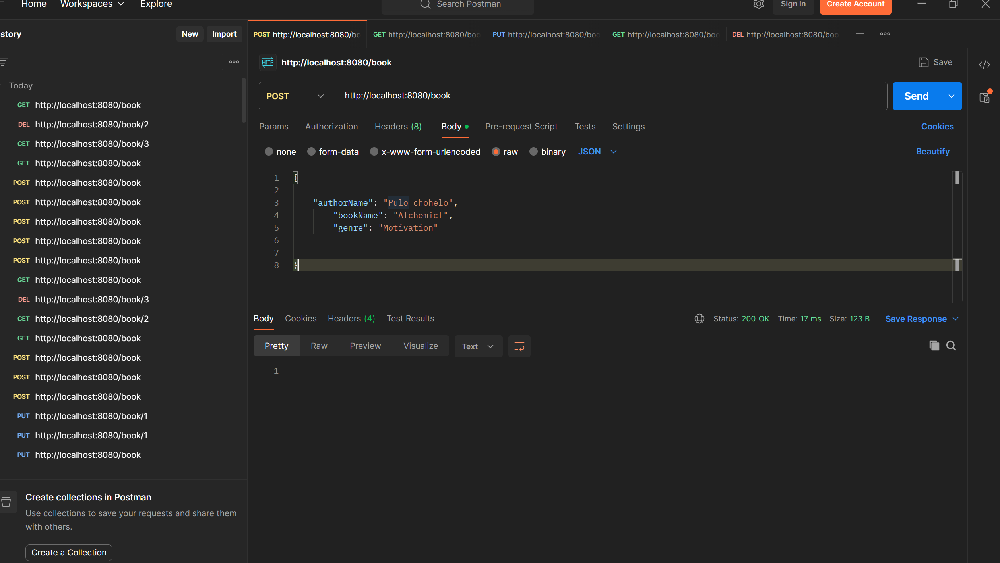
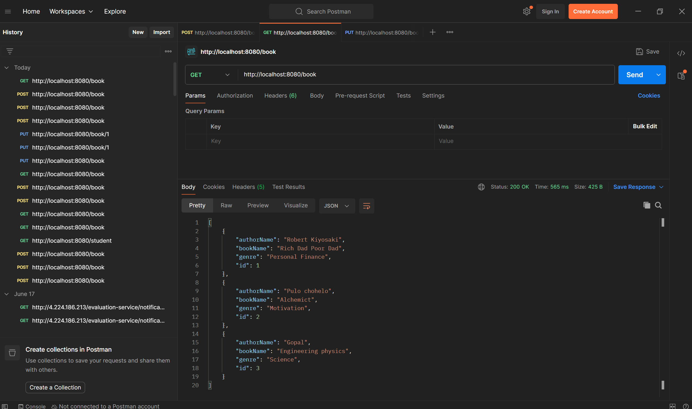
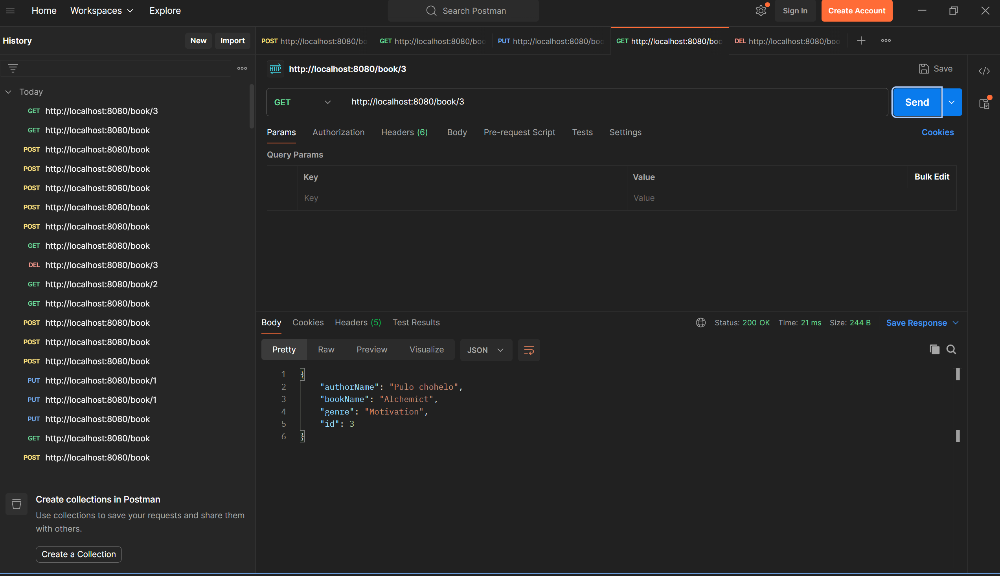
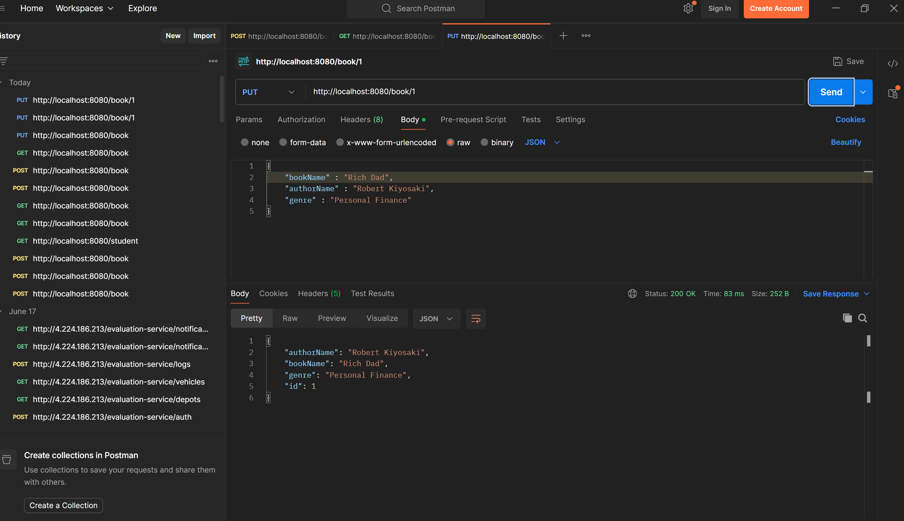
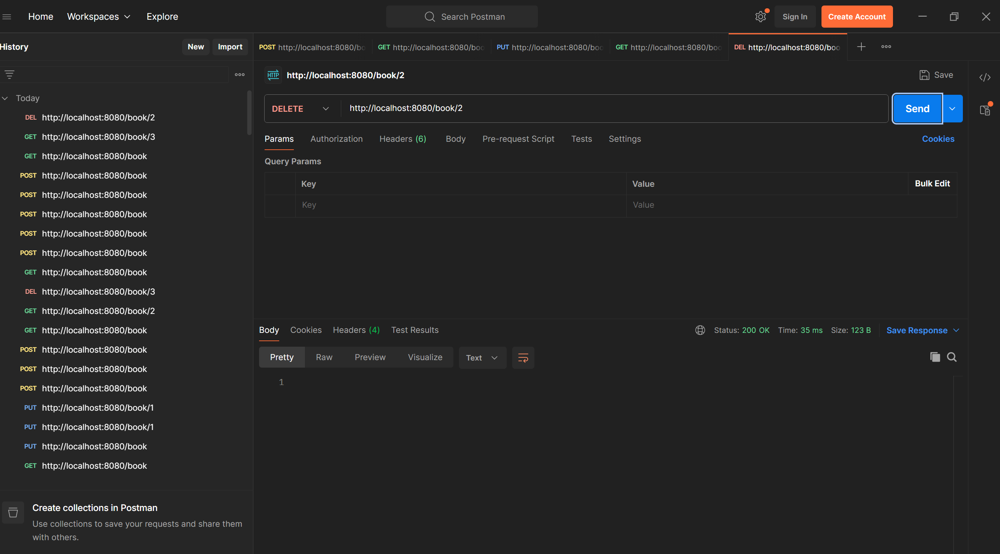
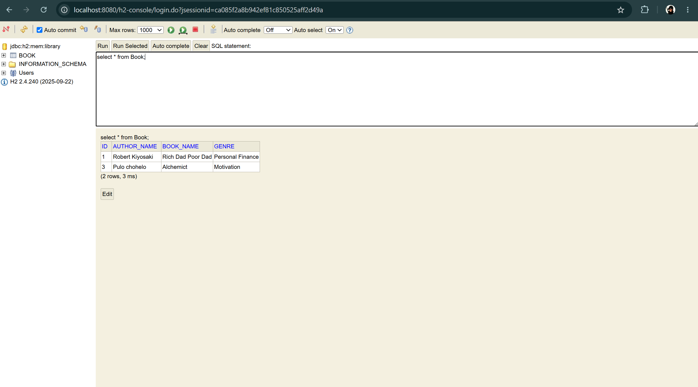

### Created a Spring Boot application for the library management system and done basic CRUD operarions and and tested the Rest APIs

### Create Book (POST Method)

---

### Retrieve All Books (GET Method - Response 1)

---

### Retrieve All Books (GET Method - Response 2)

---

### Update Existing Book (PUT Method)

---

### Delete Book (DELETE Method)

---

### H2 Database Console

