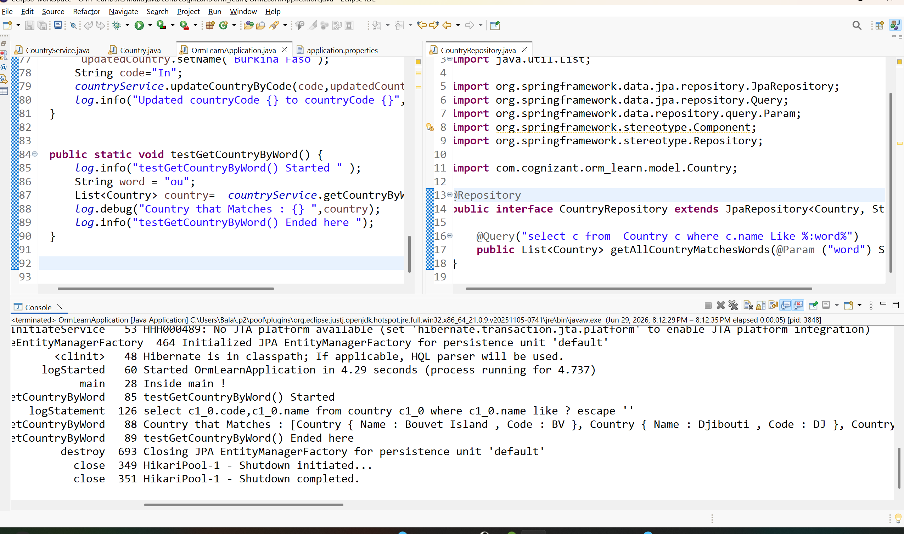

### Spring Data JPA - Quick Example Done setting up all the tings need to work with JPA and Created Country Entity 

---

## Done implementing the Service Methods in CountryService Class and tested for methods(Adding new country , deleting country ,updating county, get all the cuntries operations)

## Implemented Coustom Query using @Query Annotation

