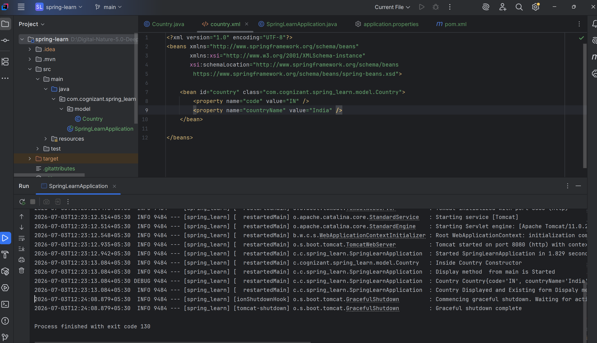
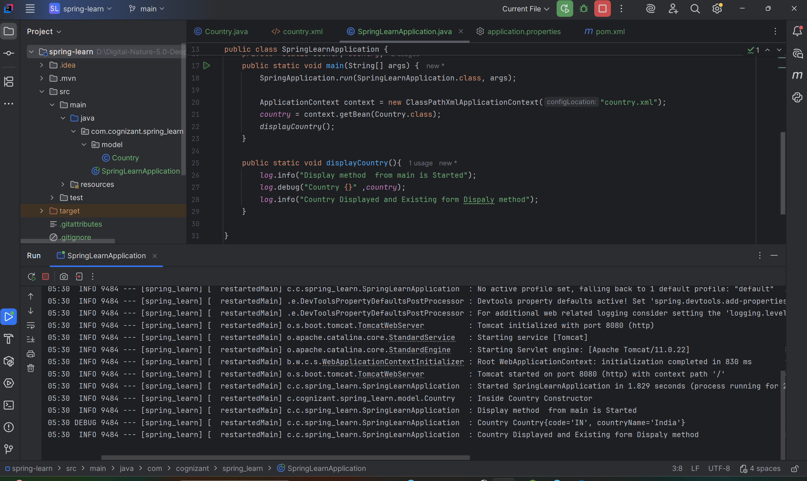
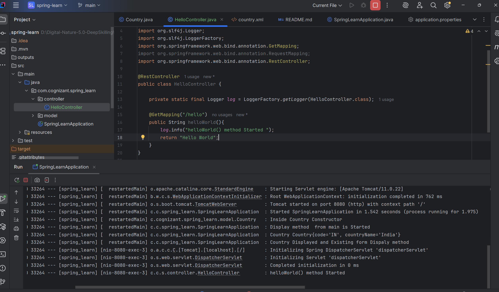
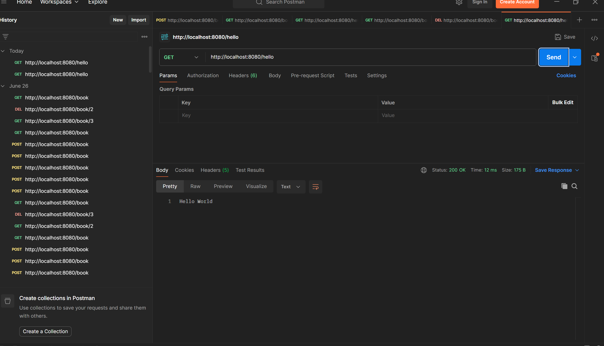
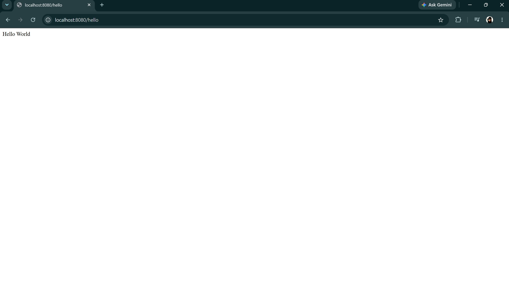
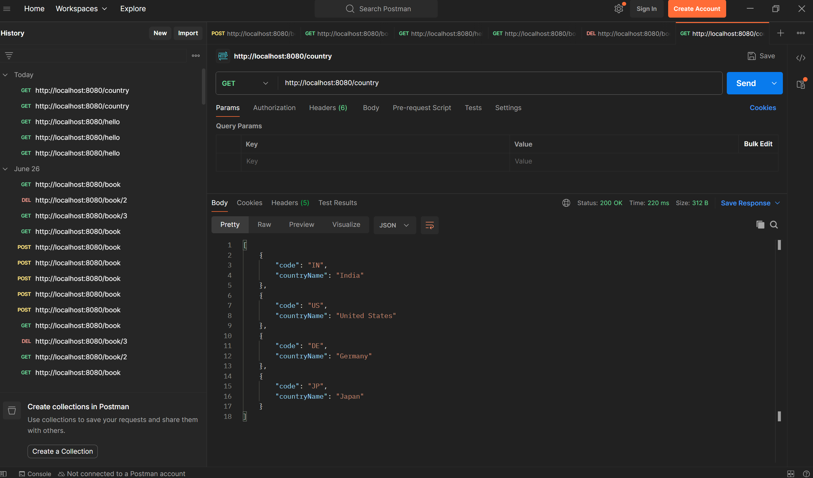
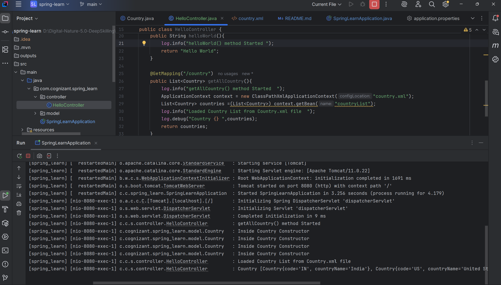
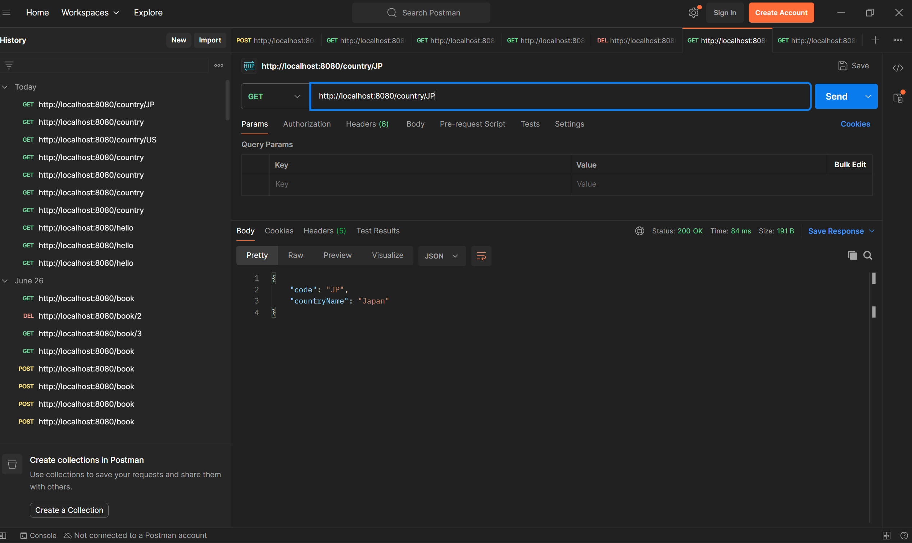
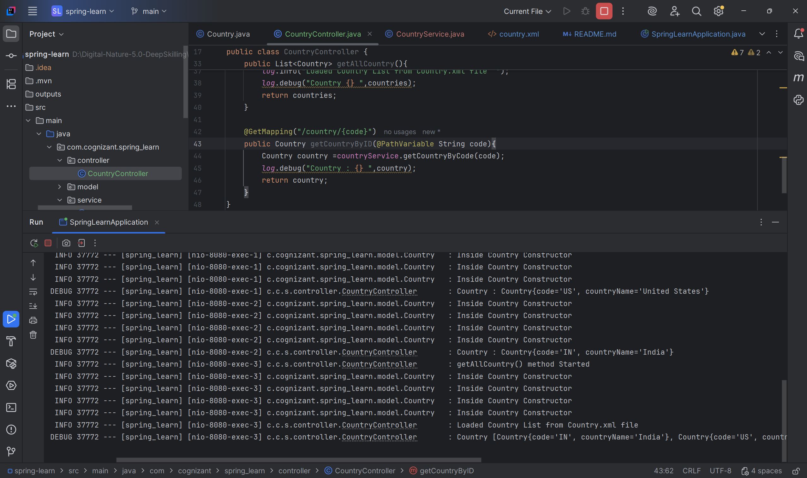

### Spring Rest using Spring Boot 
#### Exersice 1 Creating a maven Project and Setting up and Exersice 2 - Load Country from Spring Configuration XML

#### Exersice 3 Createing Hello World RESTful Web Service

#### Exersice-4 Creating REST API - Country Web Service( Using GET method) to get al countries

#### Exersic-5  - Get country based on country code 

