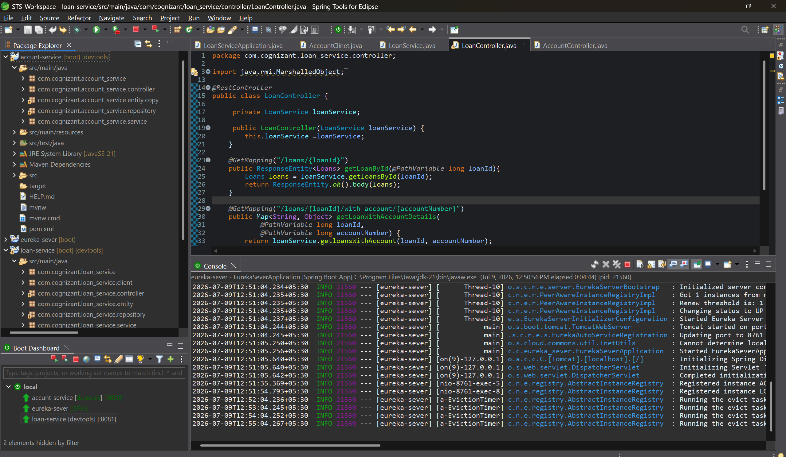
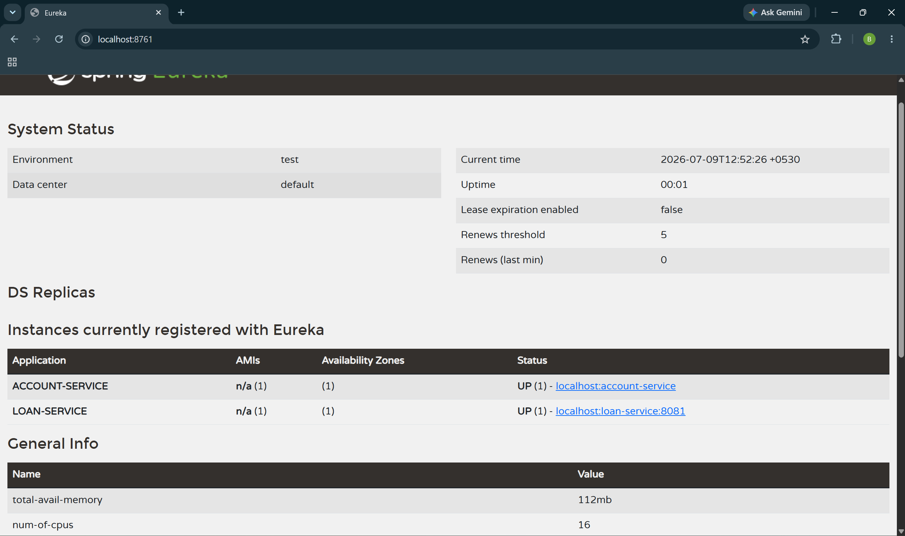
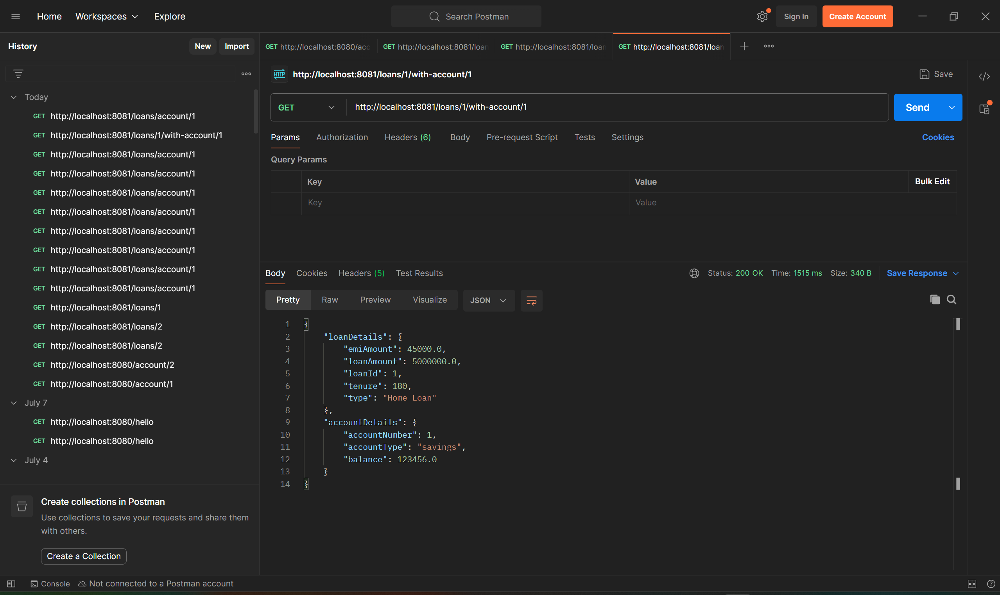
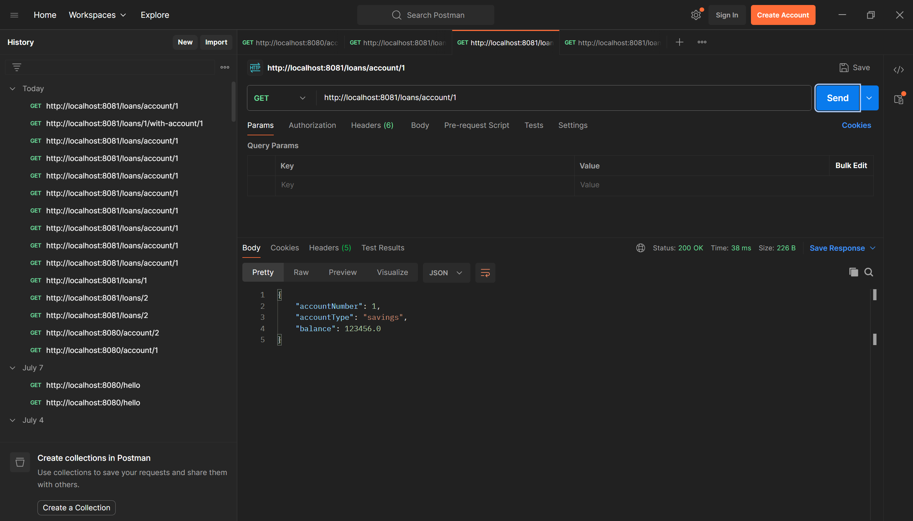

### Learned Microservices and Implemented with Two Seperate Service(Account-service and Loan-service ) and Registered with Eureka and started Three different Servers and implemented Loan- server calling Account server for account details

